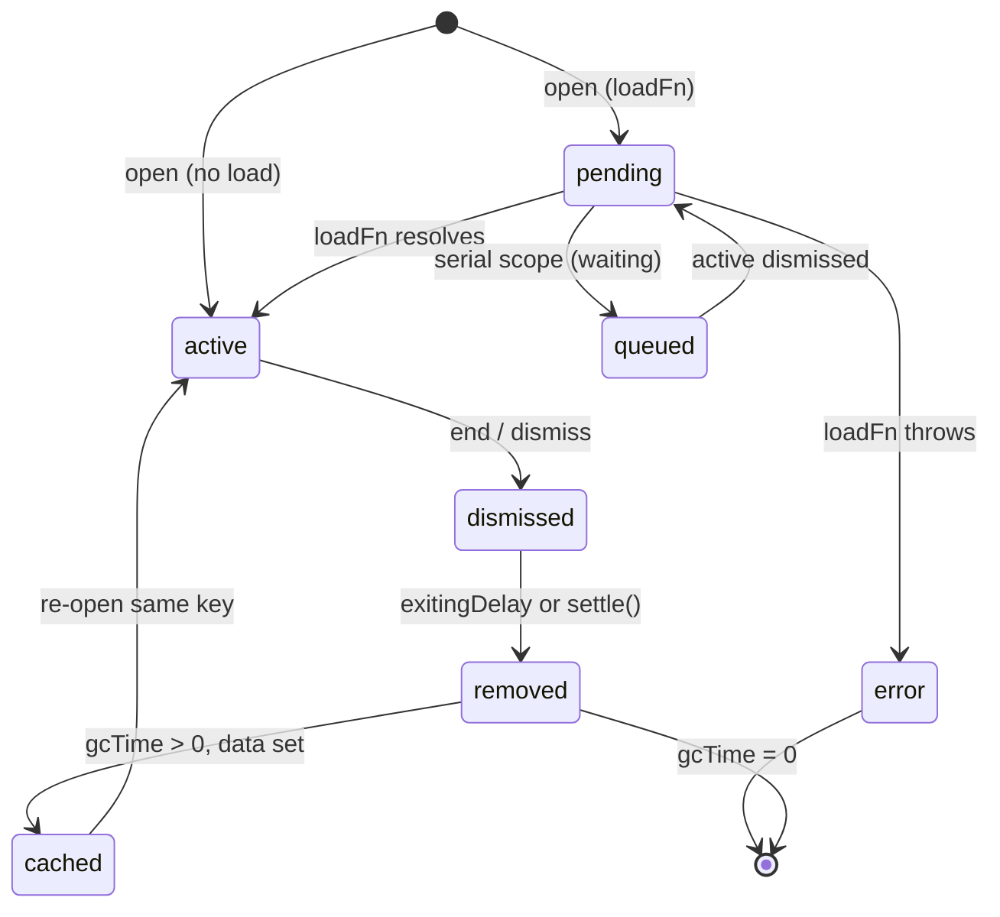

Confusing `exiting` for a phase is the most common mental-model mistake — it's a `transition` value. Layer state actually spans **three independent axes**: `phase` (resolution), `transition` (animation), and `actionStatus` (in-layer mutations).

## State flow



**Serial scope** adds `queued`: later opens wait behind an active layer and are not in `getSnapshot()` — use `getQueuedSnapshot()` to observe them.

## The three axes

```ts
phase: "pending" | "queued" | "active" | "dismissed" | "error"; // resolution
transition: "entering" | "settled" | "exiting"; // animation
actionStatus: "idle" | "running"; // in-flight action
```

### Phase — resolution lifecycle

| Phase | Meaning |
| ----- | ------- |
| `pending` | `loadFn` in flight (cancelable via `AbortController`). |
| `queued` | Serial scope only: waiting behind an active layer; not in `getSnapshot()`; visible via `getQueuedSnapshot()`. |
| `active` | Mounted; component receives `call`, `payload`, `data`, `error`, `phase`, `transition`, `actionStatus`, `dismissing`. |
| `dismissed` | Caller's `await` resolved (`ended=true`); layer may still be mounted while `transition: "exiting"`. |
| `error` | `loadFn` threw; the caller's `await` rejects. |

After dismissal, the layer is removed from the stack snapshot. If `gcTime > 0` and the layer had `data !== undefined`, it is cached off-snapshot so re-opening the same <Tooltip tip="The logical identity of a layer; find/upsert/gcTime operate on its signature.">key</Tooltip> can restore `data` without re-running `loadFn`.

### Transition — animation axis

`"exiting"` is **not** a `phase` member. Enter/exit animation lives on `transition`. `phase: "dismissed"` means the promise resolved; `transition` disambiguates exit animation vs cached:

<Panel title="Phase vs transition">
Phase is whether the layer is resolved; transition is whether it's animating — they're independent axes, so `exiting` is a transition value, not a phase.
</Panel>

| moment                       | `phase`     | `transition` |
| ---------------------------- | ----------- | ------------ |
| opening, loading             | `pending`   | `entering`   |
| opening, no load             | `active`    | `entering`   |
| open & idle                  | `active`    | `settled`    |
| dismissed, animating out     | `dismissed` | `exiting`    |
| dismissed, cached (`gcTime`) | `dismissed` | `settled`    |
| load threw                   | `error`     | `settled`    |

Completion is **whichever fires first** of `{ delay elapsed, call.settle() }`:

- `enteringDelay` — ms before `entering → settled` (default `0` = instant).
- `exitingDelay` — ms before removal after dismiss (default `0` = instant).
- `call.settle()` — imperative early finish: `entering → settled` (clears enter timer; `phase` untouched); `exiting → remove` (clears exit timer); no-op if already `settled`.

Delay `0` (default) flips the axis synchronously — no transition frame observed. For fixed CSS transitions, set `enteringDelay`/`exitingDelay` and skip `settle()`. For springs or variable duration, use a generous cap delay and `onTransitionEnd`/`onRest → call.settle()`.

### Action status — in-layer mutations

`actionStatus` (`idle` | `running`) tracks async work inside a layer — for example a submit button calling `call.setRunning(true)` during a mutation. It is orthogonal to both `phase` and `transition`.

:::warning[Blockers run before exit]
User-intent dismissal consults <Tooltip tip="A consumer predicate that gates dismissal; true allows, falsy or a thrown error vetoes.">blockers</Tooltip> **before** the exit transition. Allowed → resolve promise, `phase: "dismissed"`, `transition: "exiting"`. Vetoed → layer stays `active`. See [Blockers](/concepts/blockers).
:::
