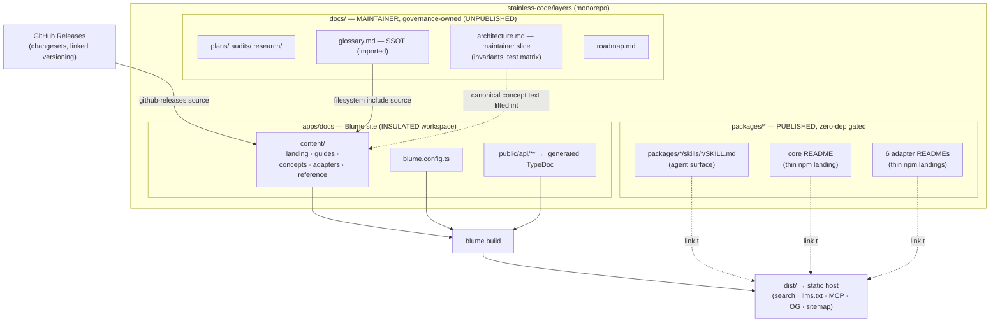
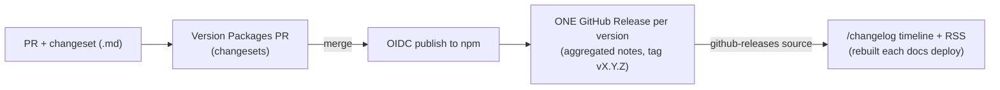

# Blume docs research — Opus 4.8

Research pass for public documentation of `@stainless-code/layers` using [Blume](https://useblume.dev/). Consolidated into [`docs/plans/blume-docs-site.md`](../plans/blume-docs-site.md); this file preserves full findings and model-specific rationale. **This pass drove the consolidated placement decision (`apps/docs/`).**

**Date:** 2026-07-14 · **Model:** Claude Opus 4.8 Thinking High

---

## Executive summary

`layers` is unusually hard to document: a **zero-dep headless core + 6 published framework adapters (7 entry points, counting Svelte runes/store)**, an engine with three orthogonal axes (`phase` / `transition` / `actionStatus`), and an _experimental, breaking-major-accepted_ API (see [`docs/plans/layer-handles.md`](../plans/layer-handles.md), which is about to rename half the adapter surface). The documentation problem is therefore **not "write pages" — it is "manage N-way duplication across 7 READMEs, 7 agent skills, `architecture.md`, `glossary.md`, JSDoc, and a soon-to-exist site without drift."**

Recommendation: stand up **Blume in an insulated `apps/docs` workspace**, fenced off from the library's strict quality gates (sherif, size-limit, oxfmt, lychee, the zero-dep guard). Establish **one canonical home per concept** — lift the engine model out of `docs/architecture.md`/`glossary.md` into canonical Blume "Concepts" pages, shrink the 7 package READMEs to thin npm landings that _link into_ the site, and keep the maintainer-only lifecycle folders (`plans/`, `audits/`, `research/`) in-repo and unpublished per the `docs-governance` skill. Feed the changelog from **GitHub Releases** (after adopting changesets _linked_ versioning so a version = one coherent release, not 7). Ship `llms.txt` + MCP so coding agents consume the docs natively.

**Day-one gotchas:**

1. Repo pins **`oxfmt@0.58.0`**, the exact version whose Markdown formatter **collapses Blume's `:::note` directives** (Blume ships a patch for that exact build).
2. **`check:links` (lychee)** runs on `**/*.md` and will **false-flag Blume's site-absolute links** (`/concepts/...`). Both must be fenced off from the library gates.

---

## Strategic positioning

### Who reads what

| Reader                   | Enters via                  | Wants                                                                 | Primary surface                                                           |
| ------------------------ | --------------------------- | --------------------------------------------------------------------- | ------------------------------------------------------------------------- |
| **Evaluator**            | Google / npm / GitHub       | 60-second pitch, when-to-use / when-to-skip matrix, one taste example | Landing + `/concepts/when-to-use`                                         |
| **Newcomer adopter**     | Landing → their framework   | Copy-paste getting-started in _their_ adapter                         | `/adapters/<fw>/getting-started`                                          |
| **Working developer**    | Search (⌘K) / sidebar       | Task recipes: serial queues, blockers, animation, validation          | `/guides/*` (adapter-parameterized)                                       |
| **Deep integrator**      | Concepts / Reference        | Engine model, three axes, SSR posture, type surface                   | `/concepts/*` + `/reference/*`                                            |
| **Contributor / porter** | GitHub                      | Test matrix, adapter-ergonomics parity table, isolation invariant     | **In-repo** `CONTRIBUTING.md` + `docs/architecture.md` (maintainer slice) |
| **Coding agent**         | `llms.txt`, MCP, `.md` URLs | Machine-readable corpus, per-page raw markdown                        | Blume AI features                                                         |

Rows 1–4 and 6 = public Blume site. Contributor row + agent config = in-repo. Maps onto `docs-governance` split.

### Experimental-status messaging

Library is pre-1.0 and accepts breaking majors (layer-handles renames `useLayer`→`useLayerState`, reshapes `useStack`, flips `LayerStack.find`). Three-layer approach:

1. **Persistent `banner`** — `"Experimental — the API may change between minors. Pin your version."` (dismissible, stable `id`).
2. **Dedicated `/concepts/stability` page** — semver posture, pinning, how breaking changes are announced (→ changelog), parity promise ("all adapters move together").
3. **Per-page callouts** on APIs in flight — `:::warning[Changing in vNext]` (e.g. handles work).

**Opinionated stance:** lead with design maturity, not version number. The grilled decision logs (layer-handles.md is 423 lines of adversarial design review) are evidence this is _carefully_ experimental, not _unfinished_. Message: "small, sharp, and honest about churn."

---

## Recommended architecture

**Decision: `apps/docs/` as a workspace member, insulated from library quality gates.**

Rejected alternatives:

- **`packages/docs`** — ❌ `packages/*` is the _published-library_ namespace; zero-dep guard, `sherif`, `size-limit`, `check:pack` all assume publishable libraries.
- **Root `docs/` (Blume reads it directly)** — ❌ `docs/` is governance-owned lifecycle substrate; would leak `plans/`/`audits/`/`research/` to the public site.
- **Separate repo** — ❌ loses edit-links, monorepo colocation, `github-releases` wiring, agent-first story.



### Insulation checklist

- Add `apps/*` to `workspaces` (dedup + `blume check` as docs typecheck), **but**:
  - `sherif` → ignore `apps/docs` (Astro/React island deps won't match library pins).
  - Root `build` already scoped (`build:core && --filter '@stainless-code/*-layers'`) — docs not swept. ✅
  - Root `test`/`test:dom`/`typecheck` use `--filter '*'`; give `apps/docs` **no** `test`/`test:dom` (skipped) and optional `typecheck: "blume check"`.
  - `size-limit`, `knip`, zero-dep guard, `check:pack` — do not extend to `apps/docs`.
  - **`oxfmt`:** exclude `apps/docs/content/**` **OR** apply Blume's `patches/oxfmt@0.58.0.patch` via `patchedDependencies`.
  - **`lychee`:** exclude `apps/docs/**` in `lychee.toml`; use `blume validate` for docs.
  - `.gitignore`: `apps/docs/.blume/`, `.blume-verify/`, `dist/`.

---

## Detailed information architecture

Use Blume **tabs** (scope sidebar). Root shows loose pages + featured links.

```
/                              Landing (pitch, taste, when-to-use, framework picker)
/concepts/stability            Experimental status, semver, pinning, parity promise

── Tab: Guides (task-oriented, framework-parameterized via <Tabs>) ──
/guides/getting-started        Install → declare → mount outlet → open+await
/guides/awaiting-results       await open, DataTag response inference, fire-and-forget
/guides/singletons             upsert + update (toasts, progress)
/guides/serial-queues          scope: serial, getQueuedSnapshot, onboarding flows
/guides/nested-overlays        layer groups (useLayerGroup / createLayerGroup)
/guides/animations             transition axis, enteringDelay/exitingDelay, call.settle()
/guides/dismissal-blockers     blockers, dismissing flag, dismissAll modes, force
/guides/payload-validation     validate (Standard Schema / fn), PayloadValidationError
/guides/error-handling         Promise<R> rejections, narrowing, isPayloadValidationError
/guides/ssr                    per-adapter SSR posture, client-only-today caveat

── Tab: Concepts (canonical engine model — lifted from architecture.md) ──
/concepts/overview             Core + adapter model, the package boundary
/concepts/lifecycle            phase / transition / actionStatus (the three axes)
/concepts/stacks-scope-gc      named stacks, serial/parallel, gcTime, upsert
/concepts/identity-and-types   key vs instance id, DataTag inference, Register
/concepts/notifications        notifyManager batching
/concepts/glossary             Ubiquitous language (imported from docs/glossary.md — SSOT)

── Tab: Adapters (one folder per adapter → tab-scoped sidebar) ──
/adapters/overview             The parity matrix (from architecture.md § Adapter ergonomics)
/adapters/core                 UI-agnostic engine surface
/adapters/react                Provider, useStack/useLayer, StackOutlet, createStackHook…
/adapters/preact               (delta from React)
/adapters/vue                  provideLayerClient, StackOutlet, …
/adapters/solid                LayerClientContext, create* aliases, …
/adapters/svelte               runes (.) + store (./store) — two entries
/adapters/angular              provideLayerClient, renderStack(vcr), inject* — divergences

── Tab: Reference ──
/reference/overview            How to read the reference; link to generated symbols
/reference/core-api            Curated: LayerClient, LayerStack, layerOptions, … via <TypeTable>
/reference/adapter-hooks       Curated hook signatures (parameterized)
/reference/api/**              Generated TypeDoc (served from public/, "generated" labeled)

── Featured (always visible) ──
/changelog                     Auto-generated timeline from GitHub Releases
GitHub                         External link
```

**Why this shape:** Guides are _task-first_ with `<Tabs>` inside each page — single biggest anti-duplication lever. Adapters is _reference-per-framework_. Concepts is the _engine_. IA teaches the architecture by existing.

---

## Single-source-of-truth strategy

**Governing rule:** one concept has exactly one canonical home; every other mention is a link, never a copy.

| Content                             | Canonical home                                          | Consumed by / mechanism                                         | Drift control                                           |
| ----------------------------------- | ------------------------------------------------------- | --------------------------------------------------------------- | ------------------------------------------------------- |
| Engine model                        | **Blume `/concepts/*`** (lifted from `architecture.md`) | Guides link; `docs/architecture.md` slimmed to maintainer slice | Content lives once                                      |
| Glossary                            | **`docs/glossary.md`**                                  | Blume filesystem include → `/concepts/glossary`                 | One file, two surfaces; fix links to site-absolute URLs |
| Per-adapter getting-started         | **Blume `/adapters/<fw>`**                              | READMEs → install + taste + link                                | READMEs too thin to drift                               |
| When-to-use matrix                  | **Blume `/concepts/when-to-use`**                       | Root README teaser + link                                       | Single authoritative matrix                             |
| Adapter parity matrix               | **Blume `/adapters/overview`**                          | Everything else links                                           | High-drift table — ONE home                             |
| Exhaustive symbol reference         | **Generated TypeDoc** → `apps/docs/public/api/**`       | Curated `/reference/*` deep-links                               | Regenerated in CI                                       |
| Changelog                           | **GitHub Releases**                                     | `github-releases` source                                        | Written once                                            |
| Agent skills                        | **In-repo**                                             | Link to site concept pages                                      | Skills reference, don't restate                         |
| Plans / audits / research / roadmap | **In-repo `docs/`**                                     | `docs-governance` lifecycle                                     | Never published                                         |

**Two hard calls:**

1. **Lift `architecture.md` consumer content into Blume; demote file to maintainer slice.** `docs-governance` supports lifting when docs become public policy.
2. **Do not auto-import the 7 READMEs into Blume.** Invert: Blume adapter pages canonical; starve READMEs to install + taste + link.

**Glossary include-source caveat:** filesystem source pointing at `../../docs` with `include: ["glossary.md"]` nests routes under a prefix and renders raw links as-is. Glossary internal links (`architecture.md#anchor`) must become site-absolute (`/concepts/lifecycle#...`) or full URLs.

---

## Blume implementation spec — `apps/docs/blume.config.ts`

See consolidated plan for the canonical draft. Opus-specific additions:

- `github.dir: "apps/docs"` — monorepo edit-link fix.
- `search: orama` — keyless; generated TypeDoc HTML under `public/api` not in Orama index (acceptable).
- `ai.mcp` off initially; enable phase 4 with `output: "server"`.
- `lastModified: true` requires `fetch-depth: 0` in CI.

---

## Content authoring workflow for contributors

1. **Local:** `bun run docs:dev` → `blume dev` in `apps/docs`.
2. **Write** `.mdx` under `apps/docs/content/`. Use `<Tabs>`, `<Steps>`, `:::note`, `<TypeTable>`, `mermaid`. Frontmatter: `title`, `description`, optional `sidebar`/`search.tags`.
3. **Framework parity:** one guide, `<Tabs>` per adapter. Reviewers reject React-only guides that duplicate recipes.
4. **Verify (agent-safe):** `blume build --isolated` / `blume check --isolated` (`BLUME_RUNTIME_DIR=.blume-verify`). Then `blume validate`.
5. **Governance:** `authoring-discipline` + `docs-governance`. New public concept → Blume, not `docs/`.
6. **Formatter fence:** exclude `apps/docs/content/**` from `oxfmt` — do not run `bun run format` over MDX.
7. **CI job `docs`:** `blume check` + `blume build` + `blume validate`, **separate** from library `CI complete`.

**Self-updating docs:** wire Blume's `blume-update-docs` agent skill into weekly automation — audits merged PRs/changelogs against docs, opens `docs/*` PR only on drift.

---

## Release / changelog pipeline

Current: changesets → Version PR → OIDC publish, per-package `CHANGELOG.md`.

**Problem:** default changesets cuts **one GitHub Release per package per bump** → 7 releases/version → noisy `github-releases` timeline.

**Recommendation — changesets linked (or fixed) versioning:** all `@stainless-code/*-layers` bump together → **one GitHub Release per version**.



Requirements:

- `GITHUB_TOKEN` in docs build/deploy env.
- Redeploy docs on `release` published.
- If per-package releases kept: timeline noisier but still works.

---

## Phase plan (tracer-bullet aligned)

### Phase 0 — Seam decision (architecture-priming)

Adding workspace app is structurally significant. This research + consolidated plan satisfies exploration; ratify or amend.

**Acceptance:** decision on `apps/docs` insulation + architecture.md lift documented.

### Phase 1 — Tracer bullet

`blume init` → `apps/docs`, minimal config, one page (`/guides/getting-started` React only), landing stub. Fence oxfmt + lychee. Root `docs:*` scripts + `docs` CI job.

**Acceptance:** `blume build` green; `blume validate` clean; library gates unaffected; preview URL.

### Phase 2 — Concepts (SSOT lift)

`/concepts/*` from `architecture.md`; glossary import; `/concepts/stability` + banner; slim `docs/architecture.md`.

**Acceptance:** one canonical page per engine concept; glossary on GitHub + site.

### Phase 3 — Guides + Adapters

`/guides/*` with `<Tabs>`; `/adapters/<fw>`; shrink 7 READMEs; update package skills to link.

**Acceptance:** no framework-forked guide duplicates; READMEs ≤ ~30 lines prose.

### Phase 4 — Reference + Changelog + AI

TypeDoc → `apps/docs/public/api/**`; curated `/reference/*`; linked versioning + `github-releases`; `llms.txt` quality pass; optional MCP.

**Acceptance:** `/changelog` populated; TypeDoc CI-generated; MCP answers sample query (if enabled).

### Phase 5 — Polish & governance close

OG images, landing, redirects; `blume-update-docs` automation; close plan per lifecycle.

---

## Anti-patterns to avoid

- ❌ Letting library formatter touch MDX (`oxfmt@0.58.0` collapses `:::note`).
- ❌ Running `lychee` over docs MDX (site-absolute links false-flag).
- ❌ Putting docs in `packages/` (trips zero-dep guard, sherif, size-limit, check:pack).
- ❌ Pointing Blume at root `docs/` (publishes plans/research).
- ❌ Auto-importing 7 READMEs as-is.
- ❌ Forking guides per framework.
- ❌ Hand-maintaining 130+ API pages.
- ❌ Committing generated `docs/api/**`.
- ❌ Per-package GitHub Releases → noisy changelog.
- ❌ Shallow CI checkout with `lastModified: true`.
- ❌ Blocking library CI on docs (keep jobs separate initially).

---

## Unique insights (Opus)

1. **Docs should mirror the seam — that's pedagogy.** Concepts + Adapters + Guides teaches core/adapter model through navigation.
2. **Three-axis model is the docs' hardest job** — dedicated `/concepts/lifecycle` with mermaid + `phase×transition` truth table from `architecture.md`.
3. **Agent-first repo → AI features are native distribution.** Prioritize `llms-full.txt` quality; ship MCP in phase 4. Users are coding agents.
4. **"Experimental" is a positioning asset** if framed with design rigor — stability page shows adversarial design process.
5. **Parity matrix is the biggest drift risk** — three current homes (architecture.md, 7 READMEs, site). Pick `/adapters/overview` only.
6. **`<TypeTable>` + Twoslash for live-typed reference** — proves `DataTag` inference works in docs, not just claims it. Uniquely on-brand for this library.
